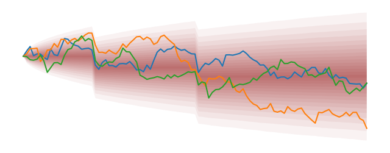

# What is finmc?

The `finmc` package contains Monte-Carlo implementations of many financial models derived from a common interface class. This interface allows computation of instruments with european, and american payoffs, as well as path dependent calculations.

<figure markdown="1">
  
</figure>

## Why do we need a common interface?

 - [Shared utilities](./utilities.md) can be used for all models for tasks such as calcualting implied vol surface.
 - [Price Calculators](./calculators.md) can be model invariant.
 - The interace is designed for high performance, even with a large number of paths.


## Getting started.

Install it from PyPI

```bash
pip install finmc
```


This is an example of pricing a vanilla option using the local volatility model.

```py
import numpy as np
from finmc.models.localvol import LVMC
from finmc.calc.option import opt_price_mc

# Define Dataset with zero rate curve, and forward curve.
dataset = {
    "MC": {"PATHS": 100_000, "TIMESTEP": 1 / 250},
    "BASE": "USD",
    "ASSETS": {
        "USD":("ZERO_RATES", np.array([[2.0, 0.05]])),
        "SPX": ("FORWARD", np.array([[0.0, 5500], [1.0, 5600]])),
        },
    "LV": {"ASSET": "SPX", "VOL": 0.3},
}

model = LVMC(dataset)
price = opt_price_mc(5500.0, 1.0, "Call", "SPX", model)
```

### Learn More
- [Dataset](./dataset.md) creation guide
- [Models](./models/api.md) included in the package